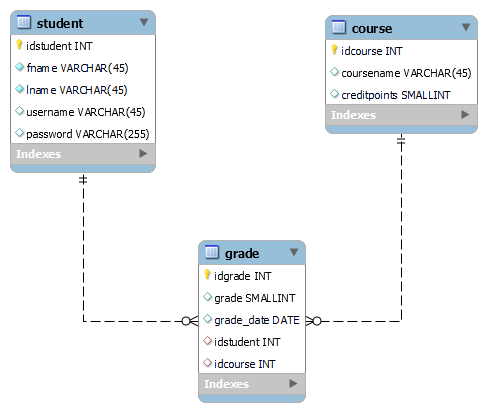

# group_x

Esimerkkinä yksinkertainen oppilaitoksen tietokanta.

Tässä lopullinen ER-kaavio

## Tietokanta yhteys

Luodaan tunnus jolla sovelluksesta kytkeydytään tietokantaan

<pre>
create user peppiuser@'localhost' identified by 'peppipass';
grant all on peppi.* to peppiuser@'localhost';
</pre>